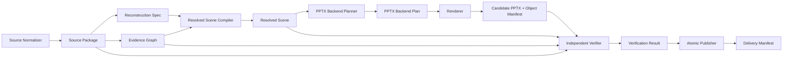

# 图片转可编辑 PPT V2 架构方案

## 文档状态

- 状态：目标架构基线
- 版本：V2
- 日期：2026-07-31
- 适用范围：`image-to-ppt` 源码项目及其生成的 `convert-image-to-ppt` Skill
- 替代对象：当前六平面单体 Task Bundle V1
- 问题来源：`docs/architecture-review-2026-07-31.md`

## 1. 决策摘要

V2 不以保留当前六平面为前提，也不在 V1 Task Bundle 上继续追加字段。V2 将系统重构为一条分权、可验证、可扩展、失败封闭的编译流水线。

核心决策如下：

1. 源图首先规范化，后续所有坐标、颜色和像素验证只绑定规范化源图事实。
2. Codex 只编辑 Reconstruction Spec 和 Evidence Graph，无权编辑编译结果、验证结果或最终状态。
3. 后端无关的 Resolved Scene 与 PPTX 专用 Backend Plan 分离。
4. Renderer 只执行 Backend Plan，不读取作者输入，不猜测布局，不临场选择降级策略。
5. Verification Result 由独立验证器生成，覆盖全部页面、全部证据、全部对象和编辑保存重开链路。
6. Delivery Manifest 由事务化 Publisher 生成，失败运行不得影响上一版成功结果。
7. 大型像素证据、蒙版、裁图、字体和图片作为内容寻址 Blob 存储，JSON 只保存引用。
8. 每个可写 Schema 字段必须存在编译器消费者、验证器或明确的 metadata-only 声明。

## 2. 目标

V2 必须支持：

- 从截图、导出图片、设计稿和扫描页重建高还原度可编辑 PowerPoint。
- 精确保留文字内容、换行、局部样式、字素度量、基线和阅读顺序。
- 表达旋转、翻转、缩放、倾斜、裁剪、蒙版、混合和多层视觉效果。
- 表达多层填充、多重描边、渐变、阴影、模糊、发光、反射和软边。
- 表达图片主体框、内容框、裁切、蒙版、Alpha 和效果边界。
- 表达路径、连接线、箭头、表格、列表、图表和未知语义组件。
- 在后端能力不足时明确降低为可编辑原语或拒绝，禁止静默近似。
- 对每页、每条源证据、每个 PPTX 对象执行独立验证。
- 支持多页、增量重建、局部复查和内容寻址缓存。
- 生成可复现、可追踪、可审计并能原子发布的最终产物。

## 3. 非目标

V2 不承担：

- 无源图依据的演示文稿创作或重新设计。
- 通过删除细节、降低阈值或修改源图事实提高验收分数。
- 把整页截图、文字截图或简单图标截图当作可编辑重建。
- 让 PPTX Renderer 根据业务语义重新计算布局。
- 保证 PowerPoint 本身无法表达的能力仍然原生可编辑；此类能力必须明确降低或拒绝。

## 4. 强制不变量

1. 源图像素事实不可由作者修改。
2. 作者不能填写覆盖率、验证状态、证明状态和最终状态。
3. 编译器不能修改源图事实以适配后端。
4. Renderer 不能读取 Reconstruction Spec 或 Evidence Graph。
5. Renderer 不能推断位置、尺寸、换行、对齐、裁切或降级策略。
6. 未被 Backend Plan 消费的可见字段必须导致编译失败。
7. 未通过全部强制门槛的运行不能生成成功 Delivery Manifest。
8. 任一页面失败，整个文档不得发布成功。
9. 失败运行不得删除或覆盖上一版成功产物。
10. 栅格对象只能代表源内容本身为栅格的照片、纹理、品牌标识或复杂插画。

## 5. 总体流水线



## 6. 数据权属

| 契约 | 生产者 | 允许修改者 | 消费者 | 信任等级 |
|---|---|---|---|---|
| Source Package | Source Normalizer | 无 | Codex、Core、Verifier | 规范化源事实 |
| Reconstruction Spec | Codex | Codex | Core | 不可信作者输入 |
| Evidence Graph | Codex/分析器 | Codex | Core、Verifier | 待验证测量声明 |
| Resolved Scene | Core | 无 | Backend Planner、Verifier | 已校验目标场景 |
| Backend Plan | PPTX Planner | 无 | Renderer、Verifier | 已确定后端执行计划 |
| Object Manifest | Renderer | 无 | Verifier | 候选对象声明 |
| Verification Result | Verifier | 无 | Publisher | 实测结果 |
| Delivery Manifest | Publisher | 无 | 交付方 | 最终发布事实 |

## 7. Source Package

### 7.1 规范化流程

Source Normalizer 必须：

1. 读取原始字节并计算原始 Blob 摘要。
2. 解析媒体类型、帧、页面、EXIF、Alpha 和 ICC Profile。
3. 应用 EXIF 方向，禁止后续阶段再次自动旋转。
4. 转换到明确的工作色彩空间，默认 sRGB；保留原始色彩描述。
5. 固定规范化画布宽高和像素格式。
6. 计算规范化像素摘要。
7. 为超大图片生成内容寻址的多级预览和局部裁图索引。
8. 保存原始文件、规范化像素和派生预览之间的完整来源关系。

### 7.2 示例

```json
{
  "schemaVersion": 2,
  "sourceId": "source-1",
  "rawBlobDigest": "sha256:...",
  "canonicalPixelDigest": "sha256:...",
  "mediaType": "image/png",
  "canvas": { "width": 1920, "height": 1080, "unit": "px" },
  "orientation": { "original": 6, "applied": true },
  "color": {
    "originalProfileDigest": "sha256:...",
    "workingSpace": "srgb"
  },
  "alpha": { "present": true, "nonOpaquePixelCount": 1420 },
  "derivedBlobRefs": []
}
```

## 8. Reconstruction Spec

Reconstruction Spec 是唯一描述可编辑重建意图的作者契约。它按文档和页面分片，不包含任何运行结果。

### 8.1 文档级结构

```json
{
  "schemaVersion": 2,
  "documentId": "document-1",
  "sourcePackageRefs": ["source-1"],
  "assetRefs": [],
  "pageRefs": ["page-1"],
  "targetIntent": {
    "format": "pptx",
    "editableTextRequired": true,
    "simpleIconsEditableRequired": true
  }
}
```

### 8.2 页面节点树

每页必须包含唯一根节点。所有节点使用判别联合，禁止依赖任意属性驱动渲染。

```json
{
  "id": "title",
  "type": "text",
  "geometry": {},
  "appearance": {},
  "content": {},
  "editability": {},
  "evidenceRefs": ["ev-title-content", "ev-title-ink"],
  "children": []
}
```

### 8.3 节点类型

- `group`
- `shape`
- `text`
- `path`
- `image`
- `icon`
- `connector`
- `table`
- `table-row`
- `table-cell`
- `list`
- `list-item`
- `chart`
- `custom-semantic`

`custom-semantic` 只扩展结构语义。所有可见内容仍必须由强类型子节点表达。

## 9. 几何与坐标模型

### 9.1 坐标规则

- Reconstruction Spec 使用规范化源画布像素坐标。
- 每个节点保存局部坐标，不重复保存可推导的世界坐标。
- Resolved Scene 保存已组合的世界变换和页面边界。
- 所有矩阵使用同一二维仿射约定，明确乘法顺序和坐标方向。
- Renderer 不能重新解释矩阵或调整边界。

### 9.2 Geometry

```json
{
  "frame": { "x": 10, "y": 20, "width": 300, "height": 80 },
  "transform": {
    "matrix": [1, 0, 0, 1, 0, 0],
    "origin": { "x": 0.5, "y": 0.5, "unit": "ratio" }
  },
  "bounds": {
    "layout": {},
    "content": {},
    "ink": {},
    "effect": {}
  },
  "clipRefs": [],
  "maskRefs": []
}
```

必须支持旋转、翻转、缩放、倾斜和通用仿射变换。透视变换如果目标后端无法可靠实现，必须在 Backend Planner 阶段拒绝或选择明确的批准策略。

## 10. 外观模型

Appearance 使用组合栈，不使用单一扁平 Style。

```json
{
  "opacity": 1,
  "fills": [],
  "strokes": [],
  "effects": [],
  "blendMode": "normal",
  "isolation": false
}
```

### 10.1 Fill

支持：

- none
- solid
- linear-gradient
- radial-gradient
- conic-gradient
- image-fill
- pattern-fill

渐变必须明确坐标空间、起止点或中心、焦点、半径、色标、扩散方式和变换矩阵。

### 10.2 Stroke

支持：

- width、color、opacity
- inside、center、outside
- line cap、line join、miter limit
- dash array、dash offset
- 多重描边
- 每边独立描边

### 10.3 Effect

支持有序效果栈：

- outer-shadow
- inner-shadow
- blur
- background-blur
- glow
- soft-edge
- reflection
- bevel
- color-adjustment

每个效果必须定义输入、参数、坐标空间和效果边界，不允许 Renderer 推断。

### 10.4 Clip、Mask 与合成

支持：

- 矩形、圆角矩形和路径裁剪
- Alpha Mask
- Luminance Mask
- 多级 clip/mask stack
- blend mode
- group isolation
- group opacity

## 11. 文字模型

文字采用“编辑意图 + 视觉测量”双轨表达。

### 11.1 编辑意图

- Unicode 原文和规范化策略
- 显式字素边界
- hard break
- run 和 paragraph 完整划分
- 字体族、PostScript Name、字体 Blob、fallback 链
- 字号、字重、字宽、样式、可变字体轴
- OpenType features 和连字策略
- 语言、脚本、书写方向
- 颜色、透明度、填充、描边和文字效果
- 下划线、删除线、强调线
- 行距、段间距、缩进、tab stop
- 水平和垂直对齐
- wrap 和 overflow 策略

### 11.2 视觉测量

- text ink bounds
- visual lines
- baseline
- line height
- cluster frames
- cluster ink bounds
- glyph/cluster advances
- shaping context
- source pixel masks

### 11.3 编译策略

Core 只能生成候选文字策略，PPTX Planner 根据目标能力确定：

- native text
- native rich text + OOXML postprocess
- positioned editable clusters
- rejected

禁止把文字转换为截图。

## 12. 图片模型

图片节点必须区分：

- 原始资源边界
- source region
- content bounds
- subject bounds
- effect bounds
- target frame
- fit mode
- crop
- transform
- clip/mask
- Alpha 事实
- 颜色调整
- 内容类别和来源方式

可用内容类别：照片、纹理、品牌标识、复杂插画。源图派生复合背景、擦字图和文字截图默认禁止。

## 13. 路径、形状和连接线

路径模型必须支持：

- move、line、quadratic、cubic、arc、close
- nonzero 和 evenodd
- 多子路径
- 规范化 viewBox 和原点
- 精确 stroke 模型
- 可选布尔运算结果及其来源证明

连接线必须支持：

- 直线、折线、曲线和 exact path
- 显式端点和锚点
- 显式路由路径
- 规范箭头路径和样式
- 与节点的语义连接关系

Backend Planner 不能重新路由连接线。

## 14. 表格、列表与图表

表格和列表保留语义结构，但可见内容必须可降低为通用原语。

表格模型应支持：

- 行列索引
- 合并单元格
- 单元格内容树
- 逐边边框
- 内边距和背景
- 阅读顺序

图表模型必须区分：

- 数据语义
- 图形语义
- 标签文字
- 最终可见几何

无法恢复真实数据时，可以按可编辑图形组重建，但不得伪造数据语义。

## 15. Evidence Graph

Evidence Graph 保存待验证的源图测量声明，支持一对一、一对多和多对多关系。

```json
{
  "id": "ev-title-subtitle-gap",
  "kind": "spacing",
  "subjects": ["title", "subtitle"],
  "sourceRegion": {},
  "measurement": {
    "axis": "y",
    "distance": 18,
    "unit": "px",
    "tolerance": 0.5
  },
  "provenance": {
    "method": "manual-measurement",
    "tool": "codex",
    "evidenceBlobRefs": []
  },
  "confidence": 1
}
```

### 15.1 Evidence 类型

- text-content
- text-ink
- geometry
- edge
- color
- gradient
- spacing
- alignment
- containment
- overlap
- occlusion
- mask
- image-region
- reading-order
- editability-intent

### 15.2 责任闭包

责任关系由以下事实共同推导：

- Evidence subjects
- 节点 evidenceRefs
- Resolved Scene 原语来源
- Object Manifest 对象来源

作者不能填写责任覆盖率。Verifier 必须从源图和闭包关系独立计算覆盖结果。

## 16. Resolved Scene

Resolved Scene 是后端无关的理想视觉真相。Core 必须完成：

- Schema 和引用闭包校验
- 样式继承和默认值展开
- 局部变换到世界变换组合
- 所有 bounds 解析
- 绘制顺序确定
- clip/mask/effect 栈解析
- 资源绑定
- 文字候选策略计算
- 证据到场景节点闭包
- 编辑性要求传播

Resolved Scene 中不得出现 PowerPoint、OOXML、artifact-tool 或其他后端专用字段。

## 17. Target Profile 与 Backend Plan

### 17.1 Target Profile

Target Profile 由运行时固定提供，不属于作者输入。它必须精确声明后端版本和能力：

- 原生能力
- 可通过 OOXML 后处理实现的能力
- 可降低为通用原语的能力
- 不支持能力
- 对象数量、路径复杂度和文件大小限制

### 17.2 Backend Plan

PPTX Planner 为每个 Scene Node 生成确定策略：

- `native`
- `ooxml-postprocess`
- `lower-to-primitives`
- `approved-original-raster`
- `rejected`

```json
{
  "sceneNodeId": "card-1",
  "strategy": "lower-to-primitives",
  "operations": [],
  "expectedObjects": [],
  "editabilityContract": {},
  "declaredLosses": []
}
```

只要存在未批准 loss 或 `rejected`，候选构建必须停止。

## 18. Renderer 与 Object Manifest

Renderer 只执行 Backend Plan，负责：

1. 创建 PowerPoint 原生对象。
2. 写入明确要求的 OOXML 后处理。
3. 保存候选 PPTX。
4. 重新打开候选文件。
5. 输出 Object Manifest。

Object Manifest 必须包含：

- sceneNodeId
- backendOperationId
- slideId
- OOXML object/relationship ID
- native object kind
- bbox 和 transform
- 文字摘要或资源摘要
- 编辑能力
- 降低策略
- 实际 OOXML 特征

## 19. 独立验证器

Verifier 不能信任作者覆盖声明，也不能只验证 Renderer 自己生成的 manifest。

### 19.1 源绑定

- 原始源摘要正确
- 规范化像素摘要正确
- 页面尺寸、方向和色彩空间正确

### 19.2 视觉验证

- 全页像素和边缘比较
- 每条 Evidence 局部比较
- 每个 Scene Node 派生保护区域比较
- 文字、图标、边框、形状、图片、连接线、间距、颜色、渐变、阴影和蒙版分别设置硬门槛
- 前景遮挡感知和绘制顺序感知
- 所有页面均需通过

### 19.3 对象验证

- Resolved Scene 到 Backend Plan 闭包
- Backend Plan 到 Object Manifest 闭包
- Object Manifest 到实际 OOXML 对象闭包
- 对象类型、数量、位置、变换和内容一致
- 无未声明对象和未声明栅格代理

### 19.4 编辑性验证

按对象类型执行真实修改：

- 文字：修改内容和局部样式
- 形状：修改位置、尺寸、填充和描边
- 路径：修改几何或控制点
- 图片：修改位置和裁切
- 连接线：修改端点
- 分组：验证成员仍可独立编辑

修改后必须保存、关闭、重开并再次检查。

### 19.5 包安全

- 禁止宏
- 禁止 OLE
- 禁止活动内容
- 禁止未声明外部关系
- 校验 ZIP/OOXML 包结构
- 校验所有输出 Blob 摘要

### 19.6 失败分类

- source-normalization
- reconstruction
- evidence
- scene-compiler
- backend-planner
- renderer
- visual-verifier
- object-verifier
- editability
- package-security
- publisher

## 20. Verification Result

Verification Result 必须记录：

- 输入摘要和工具版本
- 每页结果
- 每条 Evidence 结果
- 每个 Scene Node 结果
- 每个原生对象结果
- 源覆盖率
- 视觉指标
- 编辑性指标
- 包安全结果
- 所有失败和责任分类
- 最终状态

作者无权创建或修改 Verification Result。

## 21. 事务化发布

每次运行写入独立目录：

```text
runs/<run-id>/
```

发布流程：

1. 在运行目录生成所有候选和报告。
2. 完成 Verification Result。
3. 校验所有必需产物存在且摘要正确。
4. 生成不可变 Delivery Manifest。
5. 原子更新 `current` 指针或当前版本目录。
6. 保留上一版成功结果，按策略清理失败运行。

禁止在候选验证前删除正式产物。

## 22. Delivery Manifest

Delivery Manifest 必须绑定：

- Source Package
- Reconstruction Spec
- Evidence Graph
- Resolved Scene
- Target Profile
- Backend Plan
- Candidate PPTX
- Object Manifest
- Verification Result
- preview、diff、coverage overlay、review sheet
- 构建日志和环境快照

只有 Verification Result 为通过状态时才允许生成成功 Delivery Manifest。

## 23. 工作区结构

```text
workspace/
├── project.json
├── sources/
│   ├── source-package.json
│   └── blobs/
├── reconstruction/
│   ├── document.json
│   └── pages/
├── evidence/
│   ├── graph.json
│   └── blobs/
├── assets/
├── cache/
│   ├── source/
│   ├── scene/
│   └── backend/
├── runs/
│   └── <run-id>/
└── current
```

## 24. 缓存与增量构建

缓存键必须由真实依赖摘要组成：

- Source cache：规范化源摘要
- Reconstruction page cache：页面 JSON 摘要
- Evidence cache：Evidence 与证据 Blob 摘要
- Scene cache：页面重建、Evidence、Core 版本摘要
- Backend cache：Resolved Scene、Target Profile、后端版本摘要
- Verification cache：候选 PPTX、源图、阈值和验证器版本摘要

多页任务按页分片。单页修改只能使相关页面和文档级汇总失效，不得强制重新分析所有源图。

## 25. 内容寻址

以下内容必须内容寻址：

- 原始源文件
- 规范化像素
- 图片、字体、蒙版和裁图
- Reconstruction 页面
- Evidence 图和证据 Blob
- Resolved Scene 页面
- Backend Plan
- PPTX 和全部报告

JSON 使用规范化序列化计算摘要。内容寻址用于不可变性、缓存和发布追踪，不再为每个逻辑对象增加冗余 Artifact 封装。

## 26. Schema 工程

- 每类契约使用独立 `$id` 和版本。
- 使用判别联合和 `additionalProperties: false`。
- 公共类型拆成稳定模块，但避免循环引用。
- 扩展必须声明 namespace、版本、生产者和消费者。
- 未知可见扩展必须拒绝，不能当作 metadata 忽略。
- 每个字段必须有 field-consumption 测试。
- Major 版本允许破坏性修改。
- Minor 版本只能增加可选且已有明确消费者的能力。
- Major 版本不提供自动迁移器；破坏性切换必须通过独立契约和明确入口完成。

## 27. 包边界建议

```text
packages/core/               纯契约、Schema、验证、Resolved Scene 编译
packages/source-normalizer/  图片规范化和源缓存，可依赖图片库
packages/backend-pptx/       Target Profile、Backend Planner、Renderer、OOXML 回读
packages/verifier/           视觉、覆盖、对象、编辑性和包安全验证
packages/cli/                工作区、缓存、运行编排和事务化发布
skill-src/                   V2 Skill 模板和重建契约
```

约束：

- Core 不依赖 PPTX 后端、图片库或 Codex 宿主。
- Source Normalizer 不理解 PPTX。
- Backend PPTX 不读取源图和作者输入，只消费 Resolved Scene/Backend Plan。
- Verifier 不修改候选或作者事实。
- CLI 不修改源事实或验证结果，只负责调度和发布。

## 28. 错误处理

所有错误必须包含：

- 稳定错误码
- 阶段
- 页面 ID
- 节点、Evidence、Operation 或 Object ID
- 期望值和实际值
- 责任分类
- 可复查证据路径

不允许使用笼统的“转换失败”掩盖具体责任。

## 29. 基准图库

冻结 V2 Schema 前必须建立独立真实参考图库，至少覆盖：

1. 中文和拉丁文字混排
2. 多 run 和局部颜色
3. RTL 和复杂塑形文字
4. 旋转、翻转和倾斜对象
5. 多层渐变和透明度
6. 阴影、模糊、发光和软边
7. 路径、圆弧、evenodd 和复杂描边
8. 蒙版、裁剪和混合模式
9. 表格、列表和重复组件
10. 连接线和箭头
11. 照片、品牌标识和复杂插画
12. 多页和共享资源
13. EXIF 和非 sRGB 输入
14. 大尺寸扫描页
15. 明确无法支持且必须拒绝的案例

基准源图必须独立于当前 Renderer 生成，禁止循环自证。

## 30. 测试体系

### 30.1 契约测试

- Schema 正反例
- 字段消费闭包
- 引用闭包
- 版本拒绝与破坏性切换边界

### 30.2 Core 测试

- 坐标和变换组合
- 样式、clip、mask、effect 展开
- 文字候选策略
- Evidence 闭包
- 确定性编译

### 30.3 Backend 测试

- 每项 Target Profile 能力
- native、postprocess、lowering 和 reject
- OOXML 回读
- 未消费字段拒绝

### 30.4 验证器测试

- 独立参考图
- 故意位移、漏字、错色、错边框和错蒙版
- 覆盖率作弊
- manifest 作弊
- 编辑后保存失败
- 报告截断和 OOXML 矛盾

### 30.5 发布测试

- 失败运行保留旧版本
- 中途异常不产生半套产物
- 摘要不一致拒绝发布
- 多页任一失败阻止整体发布

### 30.6 性质与模糊测试

- 路径和变换随机组合
- Unicode 字素和复杂文本范围
- Artifact/Blob 引用图
- ZIP/OOXML 包安全

## 31. 可观测性

每次运行必须记录：

- run ID
- 各阶段耗时
- 缓存命中和失效原因
- 编译节点数量
- Backend Operation 数量
- 原生、降低、栅格和拒绝统计
- 每页视觉和编辑性摘要
- 工具、字体和环境版本

日志不得包含未声明的外部网络请求或敏感文件内容。

## 32. V1 删除策略

1. V2 从新契约实现，不调用、包装或输出 V1 Task Bundle。
2. 不提供 V1 兼容输入、自动迁移器或双栈运行模式。
3. 重构期间 V1 文件只能作为待替换代码阅读，不能成为 V2 依赖。
4. V2 闭环完成后删除 V1 Schema、六平面编译器、CLI、Skill 模板和测试。
5. V1 追溯只依赖 Git 历史和历史架构审查文档。

## 33. 实施阶段

### Phase 0：架构与基准

- 确认本文档
- 建立基准图库
- 定义验收门槛
- 确认 V1 删除清单

### Phase 1：契约与源规范化

- Source Package Schema
- Reconstruction Spec Schema
- Evidence Graph Schema
- Source Normalizer
- 内容寻址 Blob Store

### Phase 2：Resolved Scene

- Core 类型和校验器
- 变换、外观、文字和资源解析
- Evidence 闭包
- 页面分片和缓存

### Phase 3：PPTX Backend

- Target Profile
- Backend Planner
- Backend Plan Schema
- 无判断 Renderer
- Object Manifest 和 OOXML 回读

### Phase 4：独立验证

- 源覆盖
- 视觉比较
- 对象闭包
- 编辑保存重开
- 包安全
- Verification Result

### Phase 5：编排与发布

- CLI 工作区
- 增量缓存
- 失败诊断
- 事务化 Publisher
- Delivery Manifest

### Phase 6：Skill 与验收

- 重写 `skill-src`
- 新 authoring 模板
- 基准图库全量验收
- 构建产物测试
- 删除 V1 工作流并切换到 V2-only 公共入口

## 34. V2 完成标准

只有同时满足以下条件，V2 才算完成：

1. 基准图库全部得到明确的通过或能力拒绝结果。
2. 所有可见 Schema 字段都有生产者、消费者和验证器。
3. Renderer 不读取作者输入或源图。
4. 作者不能写入任何成功状态或实测值。
5. 全部页面执行视觉、对象和编辑性验证。
6. 文字、简单图标和基础形状不存在截图式成功结果。
7. 不支持能力在候选生成前明确失败。
8. 失败运行不会影响上一版成功交付。
9. 产物、摘要、日志和环境形成完整追踪链。
10. `npm test`、`npm run audit`、Skill 构建与 Skill 端到端测试全部通过。

## 35. 最终原则

V2 的成功标准不是 JSON 字段数量，而是建立完整闭环：

> 每个源图事实都有证据，每个重建节点都有明确意图，每个视觉属性都能被编译，每个后端决策都被声明，每个原生对象都可追踪，每个成功结论都来自独立实测，每次发布都完整且可恢复。
