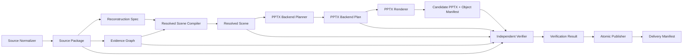

## Context

本项目的目标是把演示文稿截图、导出图片、设计稿或扫描页面重建为高还原度、可编辑的 PowerPoint。当前实现使用 V1 六平面 Task Bundle：Source、Observation、Ownership、Semantic、Render、Verification。这个设计已经比“直接图片贴进 PPT”更正确，因为它试图把源图绑定、语义建模、渲染和验证分离；但它的 JSON 实际上仍是一个混合容器，既包含作者可写的观察与语义，也包含运行生成的覆盖率、证明状态、候选产物和最终状态。

当前仓库边界大体如下：

- `packages/core` 保存 Schema、Artifact DAG、任务束校验、源输入绑定、Render Plane 编译和最终任务束物化。项目约定要求 Core 不得依赖 PPTX 后端、图片处理库或 Codex 宿主运行库。
- `packages/renderer-pptx` 负责把 Core 产出的 Render Plane 渲染为 PPTX，同时生成对象清单、layout、preview，并执行部分 OOXML 后处理。项目约定要求它只消费 Core 的 Render Plane，不从图片猜测布局。
- `packages/cli` 负责读取源图、绑定任务束、调 Renderer、做源覆盖和视觉验收、写缓存、写报告、晋升候选产物。项目约定要求 CLI 不得修改源图事实来绕过验证。
- `skill-src` 是 Codex Skill 模板源码，`dist/convert-image-to-ppt` 是生成物，禁止直接修改生成物或已安装 Skill。

### 当前转换流程

当前转换入口是 `runConversion({ sourcePath, bundlePath, outputPath, assetMapPath, analysisCachePath, strict })`。它的实际链路可以解释为：

1. 加载 Core Schema。
   - CLI 调 `loadDefaultSchema()` 得到 V1 Task Bundle Schema。
   - 这个阶段只知道“任务束应该长什么样”，还没有确认源图是否与任务束匹配。

2. 准备输出目录，并在严格模式下删除旧正式产物。
   - CLI 创建输出目录。
   - 如果 `strict=true`，会先删除目标 PPTX 和同名最终任务束。
   - 这一步是当前架构的关键风险：新候选尚未通过验证，旧成功产物已经被移除。

3. 读取源图 metadata。
   - CLI 用 `sharp(sourcePath).metadata()` 读取源图片格式、宽高和媒体类型。
   - 当前 metadata 读取没有统一应用 EXIF 方向；而后面的源覆盖探针会 `rotate()`，因此带方向标记的图片可能出现两套坐标事实。

4. 读取作者任务束并绑定真实源图。
   - CLI 读取 `bundlePath` 中的 authored Task Bundle。
   - Core 的 `bindSourceInput()` 找到唯一 `source-input` Resource，计算真实源图字节摘要、媒体类型、大小和 storageKey，然后重建 Artifact DAG。
   - 这一步把模板中的占位源图替换为真实源图，但并没有生成规范化 Source Package。

5. 校验绑定后的任务束。
   - Core 调 `validateTaskBundle()` 校验 Schema、引用闭包和部分业务约束。
   - 当前校验能发现结构错误，但不能保证作者填写的 Observation 粒度、覆盖率证明和语义证明都由独立测量支撑。

6. 校验第一页源图尺寸。
   - CLI 从 Source Plane 取 `pages[0]`，用 metadata 的宽高比对 Source Plane canvas。
   - 这说明当前协议允许多页，但执行链路实际只把第一页作为源图事实和验收对象。

7. 准备候选运行目录。
   - 严格模式下，CLI 创建 `.img2ppt-candidate-*` 临时目录。
   - PPTX、对象清单、layout、preview、diff、coverage、verification、review sheet、build log 等都先写入候选目录。
   - 这个方向是正确的，但最终晋升仍按文件逐个删除/重命名，不是原子发布。

8. 加载外部资源。
   - CLI 根据 asset map 读取图片 Blob，并用 Sharp 读取资源尺寸。
   - 当前大资源、蒙版、裁图、字体等没有统一内容寻址 Blob 契约，仍依赖运行参数和任务束描述拼接。

9. 调 PPTX Renderer。
   - Renderer 从完整任务束中找到 Render Plane，并生成 PPTX、Object Manifest、layout 和 preview。
   - 实现上 Renderer 还读取 Capability Manifest 来决定 OOXML 文字和路径后处理，这突破了“Renderer 只消费 Render Plane”的边界。

10. 计算源覆盖率。
    - CLI 的 `probeSourceCoverage()` 读取 Source/Observation/Ownership/Contract Plane。
    - 它对源图执行 `rotate().flatten().removeAlpha()`，用边缘和颜色差识别显著像素，再看这些像素是否落入作者 Observation 和 Ownership 声明的框内。
    - 风险在于 Observation 本身是作者可写的，一个过大的 shape/color Observation 可以覆盖大量显著像素，形成自证。

11. 执行候选验证。
    - CLI 的 `verifyCandidate()` 并行执行视觉差异、PPTX 对象检查和编辑性探测。
    - 当前验证比简单截图对比更强，但报告粒度仍主要绑定候选 preview 和 manifest，缺少逐 Evidence、逐 Scene Node、逐后端计划和包安全的完整闭包。

12. 生成 review sheet、分析缓存、build log 和环境快照。
    - Review sheet 把源图、渲染图和视觉报告合成便于人工复查的图片。
    - 分析缓存只在运行结束写入，转换开始时没有真正读取、校验和恢复分析结果。

13. 严格模式质量门。
    - 如果 coverage 或 verification 未通过，CLI 复制诊断文件到正式位置并报错，候选 PPTX 不发布。
    - 质量门方向正确，但它仍是在当前混合任务束上运行，且失败前旧正式产物可能已被删除。

14. 写入验证证据并物化最终任务束。
    - Core 的 `applyVerificationEvidence()` 把 bundlePhase 改为 `final`，写入 coverage 数值，把 evidence-report claim 更新为验证数值，把所有 semantic-equivalence-proof 统一置为 `proved`，并把 verification/selection/terminal 状态改为成功。
    - 这是当前最大的信任边界问题：证明状态由物化函数整体晋升，而不是由对应验证器逐 proof 生成。

15. 写最终任务束并晋升候选文件。
    - Core 的 `materializeTaskOutput()` 把候选 PPTX、preview、manifest、layout、diff、coverage、verification 等文件摘要写回 trial-candidate。
    - CLI 再把候选 PPTX 和诊断文件逐个 rename 到正式路径。
    - 缺少 Delivery Manifest 和发布指针，无法把“一次成功运行”作为不可变事实单元保存。

### 当前 JSON 是否足够表达图片细节

结论：当前 V1 JSON 不足以作为长期目标契约。它可以表达一部分常见页面：文本、简单形状、局部文字样式、基础边框、渐变、路径、连接线、图片资源、观察框、所有权关系、候选产物和验证结果。但它在高保真图片转 PPT 所需的细节上有结构性缺口：

- 源图事实不完整：没有独立 Source Package 固定原始摘要、规范化像素摘要、EXIF 应用结果、色彩空间、Alpha、页面/帧和派生裁图之间的关系。
- 几何模型不够完整：V1 以 box 和部分路径为主，缺少统一二维仿射矩阵、局部/世界变换、layout/content/ink/effect 多边界、clip/mask stack 和透视拒绝策略。
- 外观模型不够完整：V1 的 fill、border、opacity 能覆盖基础样式，但不足以系统表达多层填充、多重描边、内外阴影、模糊、发光、反射、软边、混合模式、group isolation 和效果边界。
- 文字模型仍偏扁平：虽然已有 run、paragraph、visual line、cluster 等字段，但缺少字体 Blob/fallback、OpenType feature、变量字体轴、语言脚本、复杂 shaping、文字效果和“编辑意图 vs 视觉测量”的明确权属。
- 图片模型缺少主体与裁切事实：需要区分原始资源边界、source region、content bounds、subject bounds、effect bounds、target frame、fit mode、crop、mask、Alpha 和颜色调整。
- 语义组件表达不完整：表格、列表、图表、连接线和复杂图形需要同时保留可编辑语义和可降级视觉原语；V1 很容易在语义不确定时伪造或丢失结构。
- 证据与验证混在同一个容器：作者可写的 Observation/Ownership 可以参与覆盖判断，Verification Plane 和 proof 状态又能在最终物化时被统一晋升。
- 后端能力选择位置错误：Renderer 仍能读取任务束能力并决定后处理，导致 Render Plane 不是完整后端执行契约。
- 多页和发布事实不足：Schema 容许多页，但 CLI/coverage/preview/layout 只覆盖第一页；发布也没有不可变运行目录与 Delivery Manifest。

因此，继续在 V1 六平面上追加字段会让 JSON 更大、更难校验，但不能解决“谁有权写什么、谁有权证明什么、Renderer 到底执行什么”的核心问题。V2 应重构 JSON 契约，而不是继续扩张当前六平面。

## Goals / Non-Goals

**Goals:**

- 建立 V2 契约族，明确拆分 Source Package、Reconstruction Spec、Evidence Graph、Resolved Scene、Backend Plan、Verification Result 和 Delivery Manifest。
- 让作者只编辑可编辑重建意图和待验证证据，不允许编辑运行结果、证明状态、覆盖率、候选晋升或最终状态。
- 让 Core 只产出后端无关 Resolved Scene，并保持无 PPTX、无图片库、无宿主运行库依赖。
- 让 PPTX Renderer 只执行 Backend Plan，不读取源图、不读取作者契约、不临场选择降级策略。
- 让 CLI 成为编排和验收层：源图规范化、缓存、规划、渲染、独立验证、事务化发布、报告归档。
- 支持多页、复杂几何、复杂文字、复杂外观、图片裁切/蒙版、连接线、表格/列表/图表和内容寻址资源。
- 所有成功产物必须经过逐页、逐 Evidence、逐节点、逐对象、编辑性和包安全验证。
- 完成破坏性 V2 切换，不建立 V1 输入兼容、迁移工具或双栈运行模式。

**Non-Goals:**

- 不做无源图依据的 PPT 创作或重新设计。
- 不允许用整页截图、文字截图或简单图标截图冒充可编辑重建。
- 不伪造图表真实数据；如果无法从源图恢复数据，只能按可编辑图形组重建并声明数据语义未知。
- 不保证 PowerPoint 无法原生表达的效果都能原生可编辑；必须选择明确降低、批准栅格或拒绝。
- 不直接修改 `dist/convert-image-to-ppt` 或已安装 Skill；所有 Skill 变化必须从 `skill-src` 生成。

## Decisions

### Decision 1: V2 采用契约族，而不是继续扩张六平面

V2 将当前六平面拆为七类主要契约：

- Source Package：源图事实，由 Source Normalizer 生成。
- Reconstruction Spec：作者重建意图，由 Codex 生成和修改。
- Evidence Graph：待验证测量声明，由 Codex/分析器生成和修改。
- Resolved Scene：Core 编译结果，不可作者修改。
- Backend Plan：目标后端执行计划，不可作者修改。
- Verification Result：独立验证结果，不可作者修改。
- Delivery Manifest：最终发布事实，不可作者修改。

理由：图片转 PPT 的失败通常不是字段数量不够，而是权属边界不清。把作者意图和运行证明放在同一 JSON 内，会让“可编辑、可信、可复现”三个目标互相污染。契约族可以让每个阶段只消费自己有权信任的数据，并让测试按边界编写。

替代方案：保留六平面，在每个 plane 下增加更多字段。该方案迁移成本较低，但会继续保留作者可写 proof/coverage/final 状态的历史包袱，也难以约束 Renderer 边界。

### Decision 2: Source Normalizer 是所有坐标、颜色和验证的唯一源

源图进入系统后必须先生成 Source Package。后续阶段只使用规范化画布坐标、规范化像素摘要和明确色彩空间。EXIF 方向必须在 Source Normalizer 中应用一次，并记录原始方向和已应用状态。

理由：当前 metadata 与 coverage 解码存在 EXIF 坐标分歧。高保真重建中，哪怕宽高、方向、Alpha 或色彩空间有一个阶段不一致，后续 Observation、Render、Diff 和 Coverage 都会互相错位。

替代方案：继续在各阶段读取源图并各自处理方向/色彩。该方案实现简单，但会制造多套事实。

### Decision 3: Reconstruction Spec 使用强类型节点树

作者表达可编辑意图时，必须使用判别联合节点：group、shape、text、path、image、icon、connector、table、list、chart、custom-semantic 等。每个节点显式保存 geometry、appearance、content、editability 和 evidenceRefs。

理由：图片细节无法靠通用 `kind + style + box` 长期承载。强类型节点能让 Schema、编译器和验证器知道每种对象的必填事实、可降级边界和编辑性要求。

替代方案：继续使用 V1 Semantic Plane 节点模型。该方案对现有代码友好，但表达复杂文字、表格、图表、蒙版和效果时会越来越依赖弱约定。

### Decision 4: Evidence Graph 只表达待验证声明，不表达成功

Evidence Graph 记录源图区域、测量、证据 Blob、方法、置信度、subjects 和节点引用。它不保存 coverage、passed、proved、selected、success 等状态。

理由：证据声明是作者输入，验证结论是工具输出。两者混在一起会形成自证空间。V2 中，责任闭包由 Evidence subjects、节点 evidenceRefs、Resolved Scene 来源和 Object Manifest 来源共同推导。

替代方案：沿用 Observation/Ownership/Proof，并加强校验。该方案能缓解部分作弊，但仍无法彻底阻止作者输入影响最终证明状态。

### Decision 5: Core 输出 Resolved Scene，后端规划另设 Backend Plan

Core 负责展开样式、继承、局部到世界变换、bounds、绘制顺序、资源绑定、文字候选策略和证据闭包，输出后端无关 Resolved Scene。PPTX Backend Planner 再根据 Target Profile 生成 Backend Plan。

理由：Core 应该描述“目标视觉真相”，而不是 PPTX 的具体实现。PowerPoint 能力、OOXML 后处理、对象数量限制和降级策略属于后端规划，不应该进入 Core 或 Renderer 即兴判断。

替代方案：让 Core 直接产出 Render Plane，并由 Renderer 补足能力选择。当前就是接近这种方案，边界已经出现泄漏。

### Decision 6: Renderer 只执行 Backend Plan

Renderer 的输入必须是 Backend Plan、资源 Blob 和输出路径。它只能创建对象、执行指定 OOXML 后处理、保存候选、重开候选并输出 Object Manifest。它不能读取 Reconstruction Spec、Evidence Graph、Source Package，也不能根据源图猜测布局。

Backend Plan 必须携带 Renderer 执行所需的完整事实：页面画布、operation 父子关系、局部几何、世界变换、世界边界、绘制顺序、外观、内容、资源引用，以及 expected object 是否为 virtual。语义容器若不产生真实 OOXML 对象，必须显式标为 virtual；Renderer 和验证器不得为它伪造 OOXML id。PPTX 不能无损表达的剪切、透视或其他不可分解变换必须由 Planner 在渲染前 reject，不能由 Renderer 近似。

理由：Renderer 是后端执行器，不是设计师、编译器或验证器。只有这样，后端行为才可测试、可复现，也能替换其他后端。

替代方案：继续让 Renderer 从完整任务束读取所有上下文。该方案短期方便，但后端会成为第二个编译器。

### Decision 7: 验证器独立生成 Verification Result

Verification Result 必须由独立验证器生成，并包含源绑定、逐页视觉、逐 Evidence、逐 Scene Node、逐对象、编辑性、包安全、失败分类和摘要。验证器不能信任作者 coverage/proof，也不能只信任 Renderer 自己的 manifest。

理由：高保真重建的交付价值来自“可编辑且像源图”。只有独立验证能防止截图代理、缺页、未声明对象、错误降级和不可编辑对象进入成功结果。

替代方案：继续由 materialize 阶段统一更新 proof 和 final 状态。该方案实现轻，但无法解释每个 proof 为什么成立。

### Decision 8: 发布以运行目录和 Delivery Manifest 为原子单元

每次转换写入 `runs/<run-id>/`，所有候选产物和报告都在运行目录中完成。只有 Verification Result 全部通过后，Publisher 才生成 Delivery Manifest，并通过单一发布指针或目录级切换把该 run 标记为当前成功版本。

理由：失败运行不能破坏上一版成功产物。当前逐文件删除/rename 会制造半发布状态。

替代方案：继续用临时目录和逐文件晋升。该方案代码量小，但不满足交付可靠性。

### Decision 9: 大型事实使用内容寻址 Blob，JSON 只保存引用

源图、规范化像素、局部裁图、蒙版、像素证据、字体、图片、预览、diff、PPTX 和报告都应作为内容寻址 Blob 管理。JSON 保存 digest、mediaType、byteLength、尺寸、用途、storageKey 和关系。

理由：把大块像素或二进制信息塞进 JSON 会降低可读性、复用性和缓存效率。内容寻址也能让验证器证明“当前报告对应的就是这些输入和输出”。

替代方案：把更多细节内联到任务束。该方案便于单文件传输，但不适合大图和多页。

### Decision 10: V2 采用破坏性切换，不建立 V1 兼容层

V2 公共入口只接受 Source Package、Reconstruction Spec 和 Evidence Graph。V1 Task Bundle 不提供读取、诊断、转换或迁移 API；V2 闭环完成后，V1 Schema、六平面编译器、authoring 模板、Skill 文案、CLI 入口和测试全部删除。

实现期间允许 V1 文件暂时留在源码树中作为待替换代码，但 V2 组件不得调用、包装或输出 V1 契约，也不得新增 V1/V2 adapter。每个 V2 阶段完成后直接替换对应旧阶段，最终一次性切换公共入口。

理由：兼容层会迫使系统同时维护两套数据权属、成功状态和验证模型，增加长期复杂度，也会让 V2 继续受到六平面限制。当前仓库没有必须保留的外部 V1 数据迁移责任，因此直接切换的收益更高。

替代方案：保留 V1 只读兼容或自动迁移。该方案可以维持中间可用性，但会引入用户明确不需要的双栈成本，因此拒绝。

## Target Architecture

目标流水线如下：

这条流水线的解释是：

- Source Normalizer 负责把不稳定输入变成稳定事实。
- Reconstruction Spec 和 Evidence Graph 是 Codex 的工作区，表达“要重建什么”和“为什么相信这是源图细节”。
- Core Compiler 把不可信作者输入编译成可信的 Resolved Scene。
- Backend Planner 把理想视觉场景映射到 PPTX 能力边界。
- Renderer 只照 Backend Plan 执行。
- Verifier 独立证明结果是否像源图、是否可编辑、是否安全。
- Publisher 只发布已经被验证器证明成功的 run。

## Cutover Plan

1. 初始化 OpenSpec 并冻结 V2 能力规格。
   - 产出 proposal、design、specs、tasks。
   - 当前 change 完成后，后续实现必须从 tasks 推进。

2. 新增 V2 Schema 和类型骨架。
   - 在 Core 中新增 V2 契约 Schema。
   - 添加跨契约引用、内容摘要、页面维度、单位和不变量校验。
   - V2 组件不得引用 V1 Schema 或 Artifact DAG。

3. 实现 Source Package 与源图规范化。
   - CLI 生成 Source Package。
   - 统一 EXIF、色彩、Alpha、尺寸和规范化像素摘要。
   - 后续 coverage/diff/verification 全部消费 Source Package。

4. 实现 Reconstruction Spec 与 Evidence Graph 校验。
   - Skill 模板只产出作者可写契约。
   - 禁止作者契约出现 coverage、proved、success、selected 等运行状态。

5. 实现 Resolved Scene Compiler。
   - Core 从 Reconstruction Spec 和 Evidence Graph 生成后端无关场景。
   - 当前 Render Plane 编译器只能作为阅读参考，不能被 V2 编译器调用或包装。

6. 实现 PPTX Backend Planner。
   - Target Profile 从运行时固定提供。
   - Planner 生成 Backend Plan，并在不支持能力出现时明确 lower、approved-raster 或 reject。

7. 收紧 Renderer 输入。
   - Renderer 改为只读取 Backend Plan。
   - Object Manifest 记录每个对象与 plan operation 的闭包。

8. 实现独立 Verification Result。
   - 逐页、逐 Evidence、逐节点、逐对象和编辑性验证。
   - 移除统一 proof 晋升逻辑。

9. 实现事务化发布。
   - 运行目录不可变。
   - Delivery Manifest 成功后才更新 current 指针。
   - 添加失败运行不破坏旧产物测试。

10. 执行 V2 公共入口切换并删除 V1。
    - CLI 和 Skill 只暴露 V2 输入与 V2 产物。
    - 删除 V1 Schema、六平面编译器、终态物化、authoring 模板和 V1 测试。
    - 删除所有 sourcePath/V1 bundle fallback 和 V1/V2 adapter。

## Risks / Trade-offs

- [Risk] 重构期间公共转换命令可能暂时不可用 -> Mitigation：按 V2 契约、编译器、Planner、Renderer、Verifier、Publisher 的依赖顺序完成闭环，在切换点统一恢复公共命令，不用兼容层换取表面连续性。
- [Risk] V2 Schema 过度复杂，作者难以稳定填写 -> Mitigation：Skill 模板只暴露 Reconstruction Spec 和 Evidence Graph 的作者子集，复杂默认值由 Core Compiler 展开。
- [Risk] PPTX 无法表达全部视觉效果 -> Mitigation：Target Profile 和 Backend Plan 必须显式 lower、approved-raster 或 reject，禁止静默近似。
- [Risk] 独立验证成本上升 -> Mitigation：使用内容寻址缓存、局部证据裁图、逐页增量验证和失败短路。
- [Risk] 多页和大图导致文件数量增多 -> Mitigation：以 run manifest 管理 Blob，JSON 只存引用，发布以 manifest 为入口。
- [Risk] 旧实现文件暂留会被误用 -> Mitigation：V2 模块禁止导入 V1 入口；任务清单明确最终删除范围，并用依赖边界测试阻止 V1 引用进入 V2。

## Implementation Decisions

这些决策用于关闭首轮 Open Questions，并作为后续任务的默认实现边界：

1. V2 首版按完整多页能力设计和验收，不做“Schema 支持多页但执行层只验第一页”的过渡。若某个开发里程碑临时不支持多页，必须显式返回 unsupported-multipage，不能生成成功 Delivery Manifest。
2. 编辑性验证采用深度验证：至少覆盖文字内容与局部样式、形状位置/尺寸/填充/描边、路径或控制点、图片位置/裁切、连接线端点、分组成员独立编辑。保存、关闭、重开后仍必须可检查。
3. approved-original-raster 仅允许源内容本身就是照片、纹理、品牌标识或复杂插画，且 Evidence Graph 能证明其源区域和非可编辑性质。文字截图、简单图标截图、整页截图、擦字背景和源图派生复合背景默认 rejected。
4. 不建立 V1 兼容窗口或迁移入口。V2 公共入口切换时直接删除 V1 运行时、模板和测试；Git 历史与历史架构文档足以保留追溯信息。
